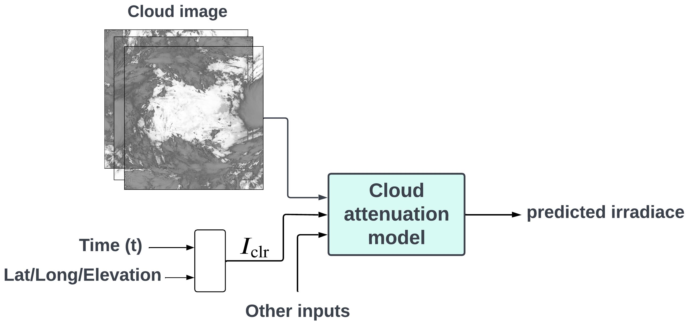

# Predicting solar irradiance using satellite images

This product aims to provide ground irradiance estimation at Synergy Technology Co., Ltd. by using a cloud attenuation model that takes cloud cover index extracted from Himawari-8 satellite as an input.

  

This repository is composed of the following folders
- **Data_preparetion** are utilized for downloading data, cleaning it, and generating datasets.
- **Model_training** contains training code for the Cloud Attenuation model. There are three groups in total: Regression, Tree-based, and CNNs models.
- **Data_visualization** is used for data and results visualization.
- **DataAndResult** store the CSV files used in this project.
